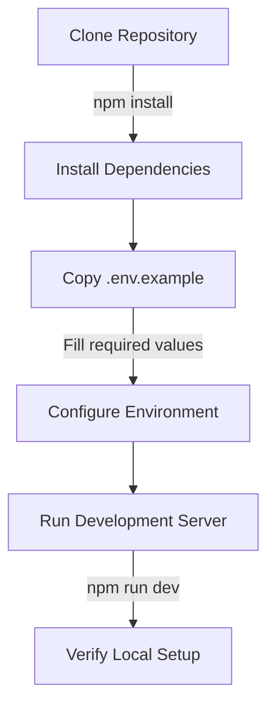
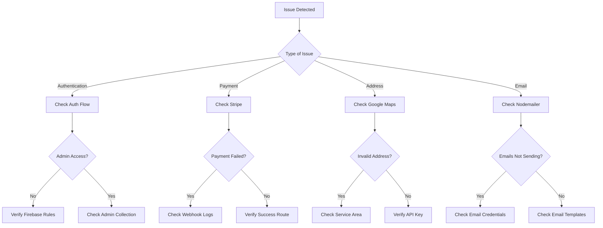

# Buckeye Bin Cleaning

A professional bin cleaning service application for the Greater Cleveland area.

## Documentation

Our documentation is organized into several sections for easy navigation:

1. [Overview & Technology Stack](./docs/overview.md)
   - Project architecture
   - Technologies used
   - Core features

2. [Service Plans & Coverage](./docs/services.md)
   - Available service plans
   - Service area coverage
   - Pricing structure

3. [Technical Account Setup](./docs/account-setup.md)
   - Firebase configuration
   - Stripe integration
   - Google Cloud Console setup
   - Nodemailer email service

4. [Environment Variables](./docs/environment.md)
   - Required variables
   - Configuration setup
   - Deployment settings

5. [Admin Dashboard](./docs/admin.md)
   - Features overview
   - Access management
   - Order tracking

6. [Order Processing](./docs/orders.md)
   - Customer flow
   - Payment processing
   - Database structure
   - Email notifications

7. [Maintenance & Support](./docs/maintenance.md)
   - Regular maintenance tasks
   - Troubleshooting guide
   - Support contacts

## Quick Start

### Prerequisites
- Node.js 18.x or later
- npm or yarn
- Firebase account
- Stripe account
- Google Cloud Console account

### Installation

1. Clone the repository:
```bash
git clone https://github.com/yourusername/buckeye-bin-cleaning.git
cd buckeye-bin-cleaning
```

2. Install dependencies:
```bash
npm install
# or
yarn install
```

3. Set up environment variables:
   - Copy `.env.example` to `.env.local`
   - Fill in the required values (see [Environment Variables](./docs/environment.md))

4. Run the development server:
```bash
npm run dev
# or
yarn dev
```

5. Open [http://localhost:3000](http://localhost:3000) in your browser

## Development

For detailed development guidelines, please refer to our [documentation](./docs/).


## Prerequisites: Installing Docker

### Windows Installation

1. Download Docker Desktop for Windows from [Docker Hub](https://hub.docker.com/editions/community/docker-ce-desktop-windows)
2. Run the installer and follow the installation wizard
3. Start Docker Desktop from the Windows Start menu
4. Verify installation by running `docker --version` in Command Prompt or PowerShell

### macOS Installation

1. Download Docker Desktop for Mac from [Docker Hub](https://hub.docker.com/editions/community/docker-ce-desktop-mac)
2. Double-click the downloaded .dmg file and drag Docker to your Applications folder
3. Open Docker from your Applications folder
4. Verify installation by running `docker --version` in Terminal

## Flow

### 1. Initial Setup (15 minutes)


### 2. Essential Configuration (30 minutes)
1. **Firebase Setup**
   - Create project
   - Enable Authentication
   - Set up Firestore
   - [Details](./docs/account-setup.md#firebase-configuration)

2. **Stripe Integration**
   - Create account
   - Get API keys
   - Configure webhook
   - [Details](./docs/account-setup.md#stripe-integration)

3. **Google Maps Setup**
   - Enable APIs
   - Get API key
   - Set restrictions
   - [Details](./docs/account-setup.md#google-cloud-console-setup)

### 3. Verify Setup (15 minutes)
- [ ] Local development server running
- [ ] Firebase authentication working
- [ ] Stripe test payment successful
- [ ] Google Maps address validation working
- [ ] Email notifications sending

## Comprehensive Documentation

### Core Documentation
1. [Overview & Technology Stack](./docs/overview.md)
   - [Project Architecture](./docs/overview.md#project-architecture)
   - [Core Technologies](./docs/overview.md#core-technologies)
   - [Project Structure](./docs/overview.md#project-structure)
   - [Core Features](./docs/overview.md#core-features)

2. [Service Plans & Coverage](./docs/services.md)
   - [Service Area](./docs/services.md#service-area)
   - [Service Plans](./docs/services.md#service-plans)
   - [Pricing Structure](./docs/services.md#pricing-structure)
   - [Service Scheduling](./docs/services.md#service-scheduling)

### Technical Documentation
3. [Technical Account Setup](./docs/account-setup.md)
   - [Firebase Configuration](./docs/account-setup.md#firebase-configuration)
   - [Stripe Integration](./docs/account-setup.md#stripe-integration)
   - [Google Cloud Setup](./docs/account-setup.md#google-cloud-console-setup)
   - [Email Service](./docs/account-setup.md#nodemailer-email-service)

4. [Environment Variables](./docs/environment.md)
   - [Required Variables](./docs/environment.md#required-variables)
   - [Environment Setup](./docs/environment.md#environment-setup)
   - [Security Considerations](./docs/environment.md#security-considerations)
   - [Troubleshooting](./docs/environment.md#troubleshooting)

### Operational Documentation
5. [Admin Dashboard](./docs/admin.md)
   - [Access Control](./docs/admin.md#access-control)
   - [Dashboard Features](./docs/admin.md#dashboard-features)
   - [Admin API Endpoints](./docs/admin.md#admin-api-endpoints)
   - [Best Practices](./docs/admin.md#best-practices)

6. [Order Processing](./docs/orders.md)
   - [Order Flow](./docs/orders.md#order-flow)
   - [Database Structure](./docs/orders.md#database-structure)
   - [API Endpoints](./docs/orders.md#api-endpoints)
   - [Error Handling](./docs/orders.md#error-handling)

7. [Maintenance & Support](./docs/maintenance.md)
   - [Regular Maintenance](./docs/maintenance.md#regular-maintenance-tasks)
   - [Troubleshooting Guide](./docs/maintenance.md#troubleshooting-guide)
   - [Security Maintenance](./docs/maintenance.md#security-maintenance)
   - [Performance Optimization](./docs/maintenance.md#performance-optimization)

## Troubleshooting Flowchart



## Common Issues and Solutions

### Authentication Issues
```javascript
// Quick auth status check
const checkAuthStatus = async () => {
  const auth = getAuth();
  const user = auth.currentUser;
  
  if (!user) {
    console.error('No user logged in');
    return false;
  }
  
  const token = await user.getIdToken();
  return !!token;
};
```

### Payment Processing
```javascript
// Verify Stripe webhook
const verifyWebhook = async (signature, payload) => {
  try {
    const event = stripe.webhooks.constructEvent(
      payload,
      signature,
      process.env.STRIPE_WEBHOOK_SECRET
    );
    return event;
  } catch (err) {
    console.error('Webhook verification failed:', err.message);
    return null;
  }
};
```

### Address Validation
```javascript
// Quick address validation
const validateAddress = async (address) => {
  const response = await fetch(
    `https://maps.googleapis.com/maps/api/geocode/json?address=${encodeURIComponent(address)}&key=${process.env.NEXT_PUBLIC_GOOGLE_MAPS_API_KEY}`
  );
  const data = await response.json();
  return data.status === 'OK';
};
```

## Support Resources

### Official Documentation
- [Next.js Documentation](https://nextjs.org/docs)
- [Firebase Documentation](https://firebase.google.com/docs)
- [Stripe Documentation](https://stripe.com/docs)
- [Google Maps Documentation](https://developers.google.com/maps/documentation)

### Community Support
- [GitHub Issues](https://github.com/yourusername/buckeye-bin-cleaning/issues)
- [Stack Overflow](https://stackoverflow.com/questions/tagged/nextjs)
- [Firebase Support](https://firebase.google.com/support)
- [Stripe Support](https://support.stripe.com)


### Docker Setup

For first-time setup and development:

```bash
docker compose up --build development
```

For production:

```bash
docker compose up --build production
```

After first time docker container creation for development run:

```bash
docker compose up development
```

After first time docker container creation for production run:

```bash
docker compose up production
```

## Branch Structure

Our project follows a structured branching strategy:

- `main`: Production releases
- `dev`: Development branch
- `test`: Test branch
- `feature/*`: New features
- `release/*`: Release preparation
- `hotfix/*`: Production fixes

## CI/CD Pipeline

Our project uses GitHub Actions for continuous integration and deployment. The pipeline is triggered on all branch pushes and pull requests.

### Pipeline Features:

#### Build Job

- Checks out code
- Caches dependencies for faster builds
- Sets up Node.js environment
- Installs dependencies
- Builds the project

#### Linting Job

- Runs on main branch
- Performs code quality checks
- Ensures coding standards are maintained

The complete workflow includes:

- Dependency caching for improved performance
- Automated builds
- Code quality verification
- Continuous integration testing

You can view the status of these workflows in the GitHub Actions tab of the repository.

## Learn More

To learn more about the technologies used in this project:

- [Next.js Documentation](https://nextjs.org/docs)
- [Docker Documentation](https://docs.docker.com)
- [GitHub Actions Documentation](https://docs.github.com/en/actions)

## Contributing

Please refer to our branch structure when contributing to the project. Create feature branches from `dev` and submit pull requests for review.

---

## **Gitflow Workflow with Release Branch**

This section outlines the Gitflow workflow for the `roadToTheClassic` project. The workflow now includes a **release branch** to prepare for production releases, ensuring that `main` remains stable and clean.

### **Branch Structure**

- **`main`**: Production-ready code.
- **`test`**: Testing environment for QA, integration testing, and API/component testing.
- **`dev`**: Development branch where features are integrated before being tested and deployed to production.
- **Feature Branches**: Created from `dev` for individual features or tasks (e.g., `feature/contact-form`).
- **Release Branches**: Created from `test` to prepare for production releases (e.g., `release/v1.0`).

---

### **Workflow Overview**

1. Developers create feature branches from `dev`.
2. Feature branches are merged into `dev` after approval via pull requests (PRs).
3. `dev` is periodically squashed and merged into `test` for testing.
4. When ready for release, create a **release branch** from `test` (e.g., `release/v1.0`).
5. Rebase the release branch onto `main` to ensure a clean history.
6. Merge the release branch into `main` for production deployment.
7. Tag the release in `main` (e.g., `v1.0`) and merge the release branch back into `dev` to bring any fixes made during the release process back into development.

---

### **Step-by-Step Workflow**

#### **1. Setting Up the Repository**

Ensure all developers have cloned the repository and set up their local environment:

```bash
git clone https://github.com/byteflow/roadToTheClassic.git
cd roadToTheClassic
```

Set up Docker for the development environment (if not already done):

```bash
docker-compose up --build
```

---

#### **2. Creating a Feature Branch**

Developers should always create feature branches from `dev`. For example, if working on a contact form:

##### **Command-Line Steps**:

1. Pull the latest changes from `dev`:

   ```bash
   git checkout dev
   git pull origin dev
   ```

2. Create a new feature branch:
   ```bash
   git checkout -b feature/contact-form
   ```

##### **VSCode UI Example**:

- Open the Source Control panel in VSCode.
- Click the branch dropdown (usually shows the current branch name).
- Select "Create new branch..." and name it `feature/contact-form`.

---

#### **3. Writing Code**

Developers write code for their feature. Commit changes frequently with meaningful messages:

```bash
git add .
git commit -m "Add initial structure for contact form"
```

Push the branch to the remote repository:

```bash
git push origin feature/contact-form
```

---

#### **4. Creating a Pull Request (PR)**

Once the feature is complete, create a PR from `feature/contact-form` to `dev`.

##### **GitHub UI Steps**:

1. Go to the repository on GitHub.
2. Click the "Pull Requests" tab.
3. Click "New Pull Request."
4. Set the base branch as `dev` and the compare branch as `feature/contact-form`.
5. Add a description of the changes and assign reviewers.

---

#### **5. Merging Without Rebasing**

After the PR is approved, squash and merge the feature branch into `dev`.

##### **GitHub UI Steps**:

1. In the PR, click "Merge Pull Request."
2. Select "Squash and Merge" (instead of "Merge").
3. Add a concise commit message summarizing the feature.

##### **Command-Line Steps** (Optional, if merging locally):

```bash
# Switch to dev
git switch dev

# Merge the feature branch
git merge feature/contact-form

# Push the updated dev branch
git push origin dev
```

---

#### **6. Merging `dev` into `test`**

Periodically, merge `dev` into `test` for testing purposes.

##### **Command-Line Steps**:

1. Switch to `test`:

   ```bash
   git checkout test
   ```

2. Pull the latest changes:

   ```bash
   git pull origin test
   ```

3. Merge `dev` into `test`:

   ```bash
   git merge dev
   ```

4. Push the updated `test` branch:
   ```bash
   git push origin test
   ```

---

#### **7. Creating a Release Branch**

When preparing to release to production, create a **release branch** from `test` (e.g., `release/v1.0`).

##### **Command-Line Steps**:

1. Switch to `test`:

   ```bash
   git checkout test
   ```

2. Create a new release branch:

   ```bash
   git checkout -b release/v1.0
   ```

3. Push the release branch to the remote repository:
   ```bash
   git push origin release/v1.0
   ```

---

#### **8. Rebasing the Release Branch onto `main`**

Rebase the release branch onto `main` to ensure a clean history.

##### **Command-Line Steps**:

1. Switch to the release branch:

   ```bash
   git checkout release/v1.0
   ```

2. Rebase onto `main`:

   ```bash
   git fetch origin
   git rebase origin/main
   ```

3. Resolve any conflicts if they arise during the rebase.

4. Force push the rebased release branch to the remote repository:
   ```bash
   git push origin release/v1.0 --force
   ```

---

#### **9. Merging the Release Branch into `main`**

Once the rebase is complete, merge the release branch into `main` for production deployment.

##### **Command-Line Steps**:

1. Switch to `main`:

   ```bash
   git checkout main
   ```

2. Pull the latest changes:

   ```bash
   git pull origin main
   ```

3. Merge the release branch into `main`:

   ```bash
   git merge release/v1.0
   ```

4. Push the updated `main` branch:

   ```bash
   git push origin main
   ```

5. Tag the release:
   ```bash
   git tag v1.0
   git push origin v1.0
   ```

---

#### **10. Merging the Release Branch Back into `dev`**

After the release is complete, merge the release branch back into `dev` to bring any fixes made during the release process back into development.

##### **Command-Line Steps**:

1. Switch to `dev`:

   ```bash
   git checkout dev
   ```

2. Merge the release branch into `dev`:

   ```bash
   git merge release/v1.0
   ```

3. Push the updated `dev` branch:

   ```bash
   git push origin dev
   ```

4. Delete the release branch:
   ```bash
   git branch -d release/v1.0
   git push origin --delete release/v1.0
   ```

---
